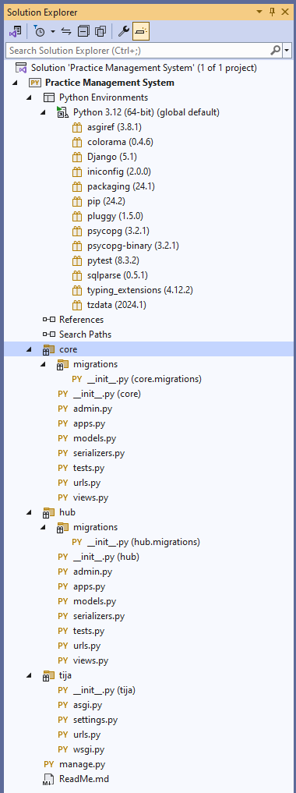

<a id="readme-top"></a>
<br />
<div align="center">
  <a href="https://www.sbsl.co.ke">
    
  </a>

  <h3 align="center">Practice Management System</h3>

  <p align="center">
    Brief overview of the project
    <br />
    <a href="https://www.sbsl.co.ke"><strong>Strategic Business Solutions Ltd »</strong></a>
    <br />
    <br />
    <a href="https://demo.sbsl.co.ke">View Demo</a>
    ·
    <a href="mailto:support@sbsl.co.ke">Report Bug or Request a feature</a>
    
  </p>
</div>


<!-- TABLE OF CONTENTS -->
<details>
  <summary>Table of Contents</summary>
  <ol>
    <li>
      <a href="#about-the-project">About The Project</a>
      <ul>
        <li><a href="#built-with">Built With</a></li>
      </ul>
    </li>
    <li>
      <a href="#getting-started">Getting Started</a>
      <ul>
        <li><a href="#prerequisites">Prerequisites</a></li>
        <li><a href="#installation">Installation</a></li>
      </ul>
    </li>
    <li><a href="#roadmap">Roadmap</a></li>
    <li><a href="#contributing">Contributing</a></li>
    <li><a href="#license">License</a></li>
    <li><a href="#contact">Contact</a></li>
  </ol>
</details>


<!-- ABOUT THE PROJECT -->
## About The Project

The project was refactored from the previous version to cater for new recommendation from a productivity tool to include all the factors of practice management including; Entity management, User/employee management, sales and proposal tracking, revenue and Profitability tracker, Project tracker and employee productivity tracker, finance tracker(Invoicing, billing, petty cash and reimbursable expense tracker), leave and absenteeism tracker, task handover and reassignment tracker, and Full reporting on all the above modules.

<p align="right">(<a href="#readme-top">back to top</a>)</p>


### Built With

This section should list any major frameworks/libraries used to bootstrap your project. Leave any add-ons/plugins for the acknowledgements section. Here are a few examples.

* Python
* PostgreSQL
* Django
* JavaScript
* HTML
* CSS
* Bootstrap
* Git
* Azure DevOps
* Visual Studio

<p align="right">(<a href="#readme-top">back to top</a>)</p>


<!-- GETTING STARTED -->
## Getting Started

Using the [Visual Studio Editor for Python](https://learn.microsoft.com/en-us/visualstudio/python/?view=vs-2022) is a personal preference. Feel free to use any other editor of your choice.


### Prerequisites

This is a list of things you need to use the software and how to install them.
* python
* an editor of your choice
* postgresql

### Installation

_Below is an example of how you can instruct your audience on installing and setting up your app. This template doesn't rely on any external dependencies or services._

1. Get access to the repo [Practice Management Repository](https://dev.azure.com/sbslpracticeManagementSystem/Practice%20Management%20System/_git/Practice%20Management%20System)
2. Clone the repo
   ```sh
   git clone https://sbslpracticeManagementSystem@dev.azure.com/sbslpracticeManagementSystem/Practice%20Management%20System/_git/Practice%20Management%20System
   ```
3. Install Python packages
   ```sh
   requirements.txt
   ```
4. Install PostgreSQL
   ```sh
   username: postgres password: postgres
   ```

<p align="right">(<a href="#readme-top">back to top</a>)</p>


<!-- ROADMAP -->
## Roadmap

- [x] Create ReadMe file
- [ ] Add Changelog
- [ ] Add Unit tests
- [ ] Add UI template
- [ ] Update ReadMe file
- [ ] Complete a module
    - [ ] Entity management
    - [ ] Employee management

See the [open issues](https://dev.azure.com/sbslpracticeManagementSystem/Practice%20Management%20System/_workitems/recentlyupdated/) for a full list of proposed features (and known issues).

<p align="right">(<a href="#readme-top">back to top</a>)</p>


<!-- CONTRIBUTING -->
## Contributing

1. Clone the Project
2. Create your Feature Branch (`git checkout -b feature/AmazingFeature`)
3. Commit your Changes (`git commit -m 'Add some AmazingFeature'`)
4. Push to the Branch (`git push origin feature/AmazingFeature`)
5. Create a Pull Request

**Only push/merge working code to main/master branches**

<p align="right">(<a href="#readme-top">back to top</a>)</p>

<!-- LICENSE -->
## License

Copyright © 2024. [Strategic Business Solutions Ltd](https://www.sbsl.co.ke)

<p align="right">(<a href="#readme-top">back to top</a>)</p>


<!-- CONTACT -->
## Contact

Email Support - mailto:support@sbsl.co.ke

Project Link: [Strategic Business Solutions Ltd](https://www.sbsl.co.ke)


<p align="right">(<a href="#readme-top">back to top</a>)</p>

